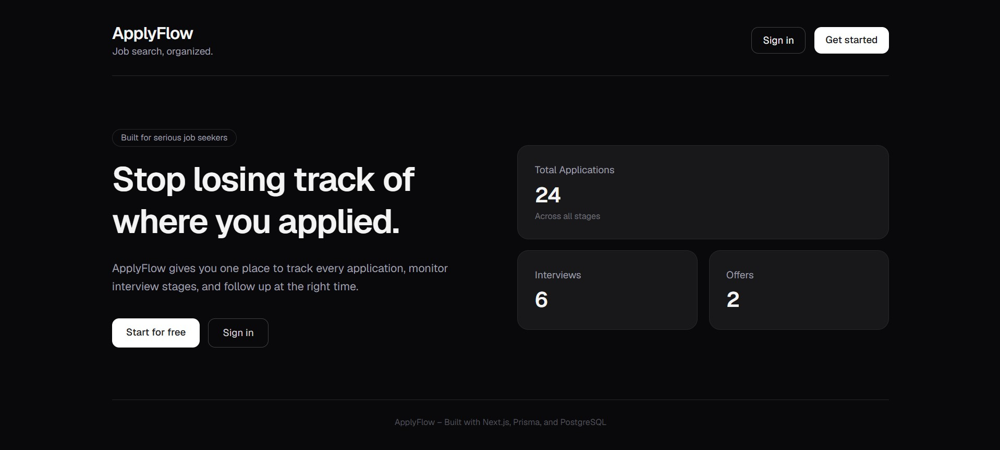
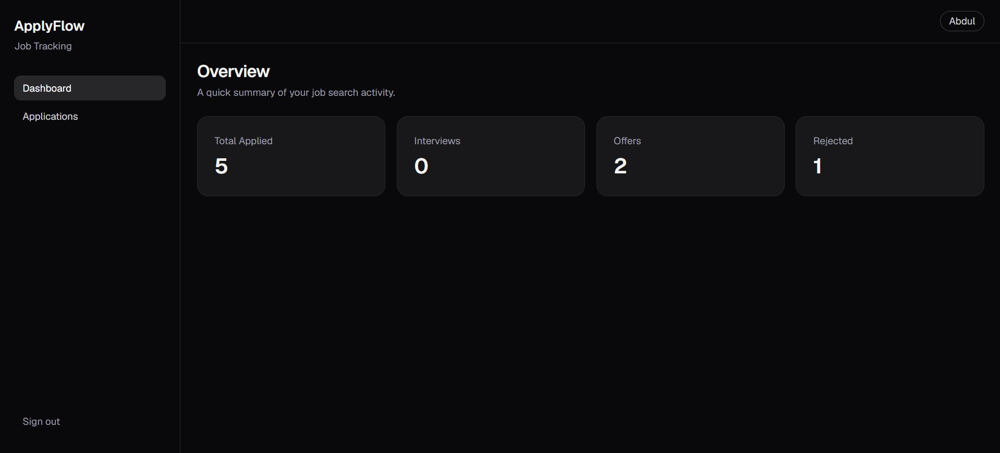
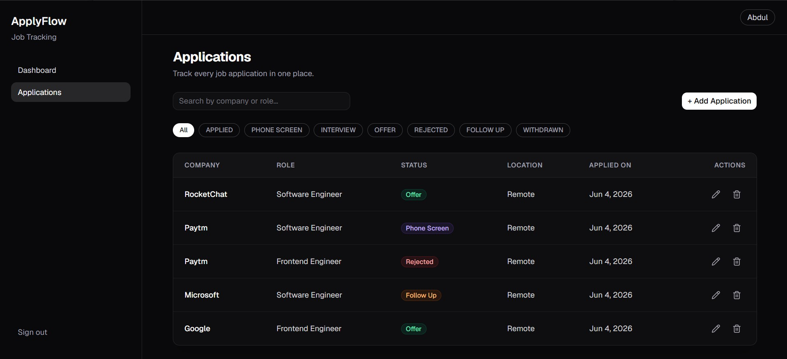

# ApplyFlow

> Track every job application. Know exactly where you stand.

**[Live Demo →](https://applyflow-saas.vercel.app)**





Job searching across 10 tabs and a spreadsheet gets messy fast.
ApplyFlow gives you one place to track applications, monitor stages, and follow up at the right time.

## Stack

`Next.js 15` · `TypeScript` · `PostgreSQL` · `Supabase` · `Prisma` · `NextAuth v5` · `React Hook Form` · `Zod` · `shadcn/ui`

## Features

- Email/password authentication with secure bcrypt hashing
- Add, edit, delete applications with confirmation on delete
- Status tracking - Applied, Phone Screen, Interview, Offer, Rejected
- Dashboard metrics - total, interviews, offers, rejected
- Search by company or role
- Filter by application status
- Expandable rows to view notes
- Responsive layout with mobile navigation

## Setup

```bash
git clone https://github.com/AbdulShaikz/applyflow
cd applyflow
npm install
cp .env.example .env
```

Fill in `.env`:
```env
DATABASE_URL=    # Supabase PostgreSQL connection string
AUTH_SECRET=     # openssl rand -base64 32
```

```bash
npx prisma migrate dev
npm run dev
```

## Trade-offs

- **Client-side search** - fast at personal scale, would move to Postgres `contains` with debouncing for multi-user
- **No pagination** - first thing to add before opening to other users
- **Email/password only** - OAuth would be the next auth addition